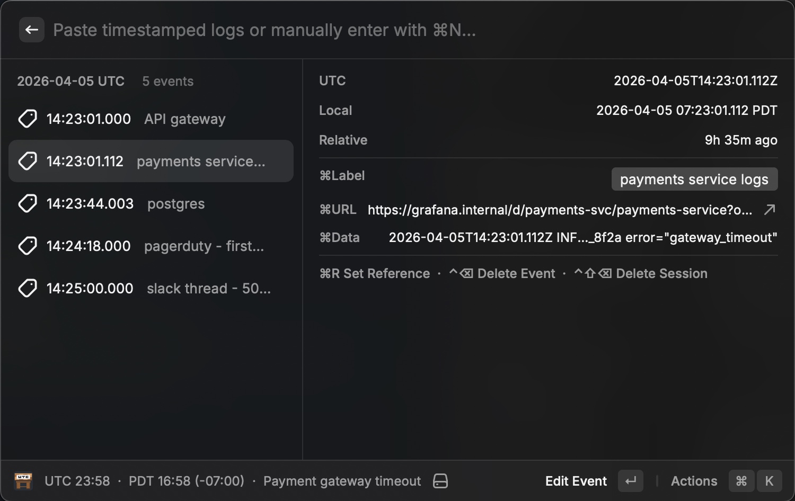
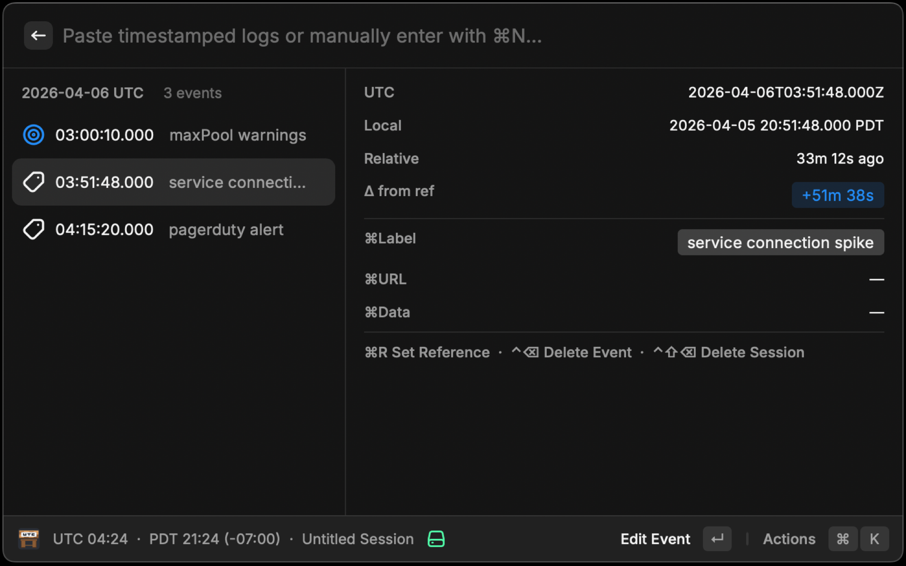
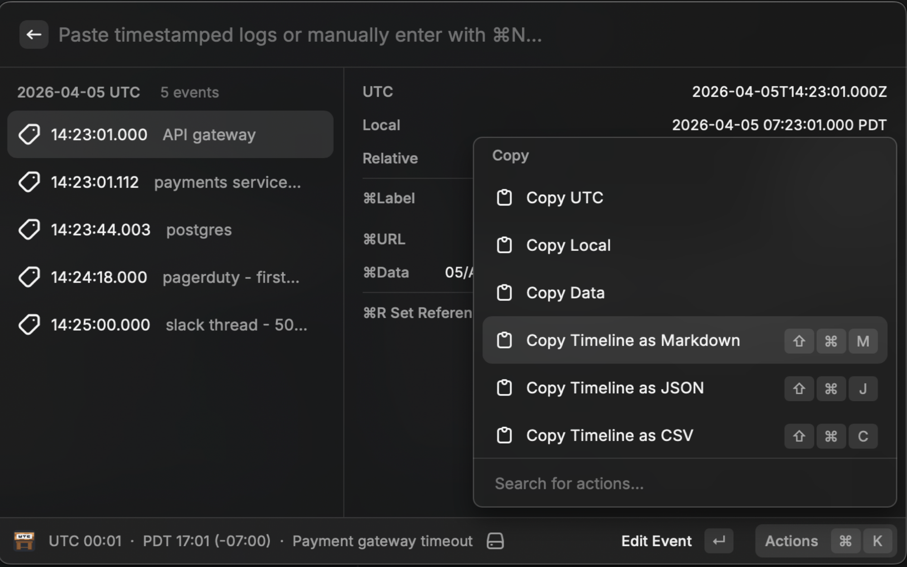

# UTC Workbench

Paste log lines from any source, normalize timestamps to UTC, and reconstruct a timeline as you debug.

Quickly see time offsets from a reference event to a target event.

As you conclude investigation, export the timeline as JSON, CSV, or markdown to transcribe into other ticketing systems.

## Audience

If you find yourself searching "UTC to \{timezone\}" throughout your workday, this tool is for you.

While troubleshooting an incident, you are pulling timestamps from all over-- some are system logs in a variety of formats, some are localized and presented in a human readable format, and some are just notes communicated from a user. You need to answer "what happened in what order" and "how long between X and Y" — and you need to do it fast, while people are waiting in the incident channel.

UTC Workbench is a timestamp normalizer and timeline builder that lives in Raycast. Paste a log line, get UTC. Paste five log lines from different systems, pin them, and you have a chronological timeline of labeled data with links back to their source.

## How it works

Add events manually, or paste a log line into the search bar to have UTC Workbench extract and resolve timestamps from raw text. If a timestamp is ambiguous, it is flagged for manual timezone assignment. Timestamps you log are recorded and presented in UTC.

- **Pin** timestamps as you troubleshoot to build a timeline. Events are sorted by UTC and grouped by date.
- Set any event as a **reference point** to see offsets relative to a specific moment (e.g., "how long after the first 503 did the alert fire?").
- **Label** events by source (e.g., `nginx`, `postgres`, `pagerduty`) and attach **URLs** or other raw **Data**.
- When the investigation is done, **Export** the assembled timeline as Markdown, JSON, or CSV.
- **Sessions** let you save and switch between investigations.
